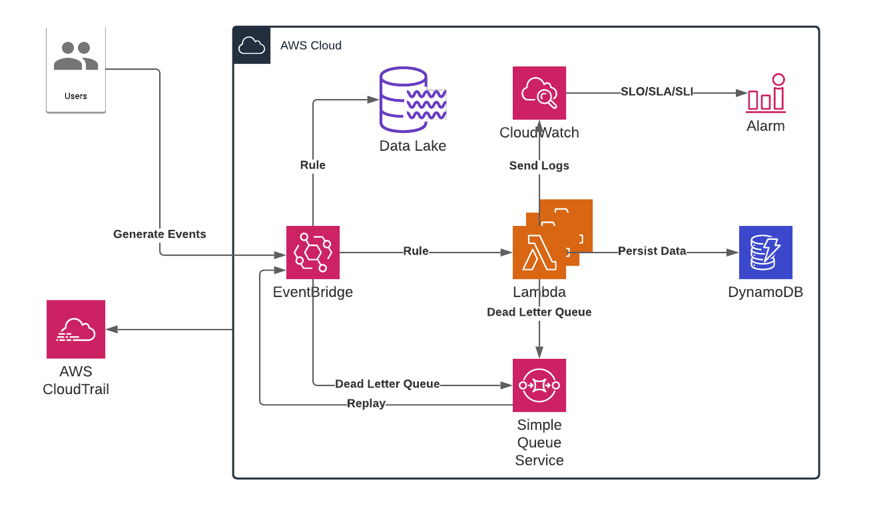

# EventBridge Application With Lambda

This is a small application that will take an event and will increment a counter in a DynamoDB given the event specification.

The purpose of this application is to demonstrate how to develop and test a serverless function locally without the need of building a test environment in the cloud. It aims to reproduce different test approach to validate code changes.

This example was build with testability as a key non-functional requirement and also aims to be lenient when an error occures. Deployments are beyond the scope of this example.



The CloudTrail and DataLake are displayed in the previous diagram as examples, but not actually setup for local testing.

## Working With This Project

This project has working components available through [localstack](https://github.com/localstack/localstack).

* AWS SQS
* AWS DynamoDB
* AWS CloudWatch Logs
* AWS EventBridge with a Rule
* AWS Lambda

### Start Localstack

In this project LocalStack was used to setup the mocked AWS infrastructure locally. In order to validate if your laptop has the required tools to work with this project, you can run the `./setup.sh` script and it will let you know if something is missing. The script assums that you run `MacOS`.

Following the successful execution of `./setup.sh`, you can run:
```bash
hatch run start
hatch run status
hatch run refresh
```

It will output the state of `localstack` and the status of all the mocked services available. From this point on you can use the CLI tool called `awslocal` which is a wrapper around the `aws` cli tool but that make sure the `--endpoint-url` always points to your running instance of `localstack`. The endpoint url that will be used by awscli is `localhost.localstack.cloud:4566` which does not have real authentication and authorization.

Here are the dummy values that will be used for authentication and authorization:

```bash
AWS_ACCESS_KEY_ID=XXXXXXXXXXXXXXX
AWS_SECRET_ACCESS_KEY=YYYYYYYYYYYYYYYYY
AWS_DEFAULT_REGION=us-east-1
LOCALSTACK_HOST="localhost.localstack.cloud:4566"
```

### Run Tests Against Lambda Code

From this point on, you can run the different test against the code. Note that only the test marked as infrastructure will leverage `localstack` at this point.

```bash
hatch shell
hatch env prune
hatch env show
hatch run test:all
hatch run +py=3.12 test:all
hatch run test:unit
hatch run test:integration
hatch run test:infrastructure
```

### Clean Resources and Environment From LocalStack

To make sure you start from scratch, you can use the following commands the clean up any leftover resources from previous work in your running instance of `localstack`.
Errors are safe to ignore.

```bash
hatch run refresh
```

## Setup Localstack

Running the commands below to create the required resources.

* AWS SQS
* AWS DynamoDB
* AWS EventBridge with a Rule
* AWS Lambda

### Create Lambda

This will create the lambda package and 'upload' it, it will associate the dead letter queue to it as well. We re-package the lambda (the zip file) each time to grab the latest code changes.

```bash
hatch run lambda
```

#### Test Lambda Invocation

Executing the following will trigger an execution of your lambda and pass the payload as the event. The output of the lambda will be stored in the `dist/response.json` folder.

```bash
mkdir dist
awslocal lambda invoke \
  --cli-binary-format raw-in-base64-out \
  --log-type tail \
  --function-name lambda-testing \
  --payload '{"detail": {"coordinate": {"x": "5", "y": "5"}, "type": "fake"}}' \
  dist/response.json
```

### See Logs Generated by Lambda

The lambda generates logs, they will be available in the `localstack` implementation of CloudWatch and can "tail" the logs with the following command.

```bash
awslocal logs tail /aws/lambda/lambda-testing --follow
```

### Create Event Bridge

This will create an event bridge with a rule to target any event with `cli` as srouce to trigger the lambda function.

```bash
hatch run eventbridge
```

### Create DynamoDB Table

This will create a simple DDB table with one key and one field. The field will simply be a number that our query will increment.

```bash
hatch run dynamodb
```

#### Test DynamoDB Table

This is a simple DDB query that will cause the field Distance to be incremented by one. This will validate that our DDB was created properly and seeded with a number as value for the field `Distance`.

```bash
awslocal dynamodb update-item \
  --table-name Distance \
  --key '{"Name": { "S": "Distance" }}' \
  --update-expression "SET Distance = Distance + :incr" --expression-attribute-values '{":incr":{"N":"1"}}' \
  --return-values UPDATED_NEW
```

#### Validate DynamoDB data update

With this command you can look at the value of your counter and match it against the amount of events you fired that had the persistance setting set properly. It should be a good indication if you missed events or not. Missing events are most likely in the Dead Letter Queue SQS queue.

```bash
awslocal dynamodb scan --table-name Distance
```

### Send Event to EventBridge

This command will grab the content of `etc/events/events.json` and send it to the eventbridge. You can put as many events in this file as you whish, feel free to experiment and craft events that are edge cases.

```bash
awslocal events put-events --entries file://etc/events/events.json
```

### Validate Dead Letter SQS

With this command you can grab the count attribute for the queue. In a ideal production world this should always be zero.

```bash
hatch run awslocal sqs get-queue-attributes \
  --attribute-names ApproximateNumberOfMessages \
  --queue-url http://sqs.{env:AWS_DEFAULT_REGION}.{env:LOCALSTACK_HOST}/000000000000/lambda-testing-dlq
```

### Recreate Lambda and Push Events

To recreated the lambda and trigger its execution through events, below is the list of commands:

```bash
hatch run relambda
awslocal events put-events --entries file://etc/events/events.json
```
